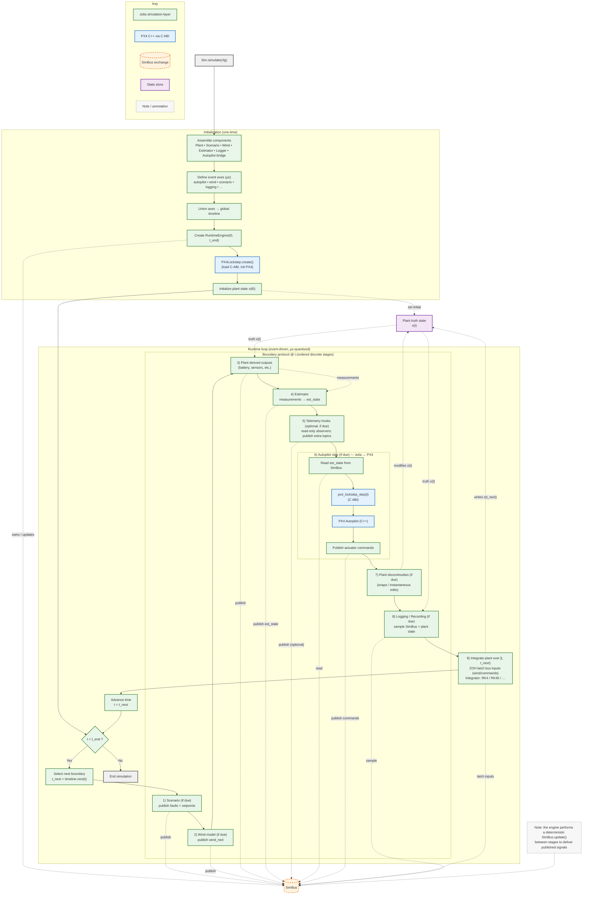

## Architecture in one picture

```mermaid
flowchart TB
  %% ---------- Styles ----------
  classDef julia fill:#e8f5e9,stroke:#2e7d32,stroke-width:2px;
  classDef px4 fill:#e3f2fd,stroke:#1565c0,stroke-width:2px;
  classDef bus fill:#fff3e0,stroke:#ef6c00,stroke-width:2px,stroke-dasharray: 6 4;
  classDef store fill:#f3e5f5,stroke:#6a1b9a,stroke-width:2px;
  classDef note fill:#f7f7f7,stroke:#666,stroke-width:1px,stroke-dasharray: 4 3;
  classDef startend fill:#f0f0f0,stroke:#333333,stroke-width:2px;

  %% ---------- Shared objects ----------
  BUS[(SimBus)]:::bus
  X["Plant truth state<br/>x(t)"]:::store

  %% ---------- Entry ----------
  Start["Sim.simulate(cfg)"]:::startend --> Cfg

  %% ---------- Initialization ----------
  subgraph INIT["Initialization (one-time)"]
    direction TB
    Cfg["Assemble components<br/>Plant • Scenario • Wind • Estimator • Logger • Autopilot bridge"]:::julia
    Axes["Define event axes (µs)<br/>autopilot • wind • scenario • logging • …"]:::julia
    Timeline["Union axes → global timeline"]:::julia
    Engine["Create RuntimeEngine(t0, t_end)"]:::julia
    PX4Init["PX4Lockstep.create()<br/>(load C-ABI, init PX4)"]:::px4
    InitState["Initialize plant state x(t0)"]:::julia
    Cfg --> Axes --> Timeline --> Engine --> PX4Init --> InitState
  end

  Engine -. owns / updates .-> BUS
  InitState -. set initial .-> X
  InitState --> Cond

  %% ---------- Runtime loop ----------
  subgraph LOOP["Runtime loop (event-driven, µs-quantized)"]
    direction TB

    Cond{"t < t_end ?"}:::julia
    Cond -- "No" --> End["End simulation"]:::startend
    Cond -- "Yes" --> NextT["Select next boundary<br/>t_next = timeline.next(t)"]:::julia

    %% ===== Boundary protocol =====
    subgraph BP["Boundary protocol @ t (ordered discrete stages)"]
      direction TB

      S1["1) Scenario (if due)<br/>publish faults + setpoints"]:::julia
      S2["2) Wind model (if due)<br/>publish wind_ned"]:::julia
      S3["3) Plant derived outputs<br/>(battery, sensors, etc.)"]:::julia
      S4["4) Estimator<br/>measurements → est_state"]:::julia
      S5["5) Telemetry hooks (optional, if due)<br/>read-only observers; publish extra topics"]:::julia

      subgraph AP["6) Autopilot step (if due) — Julia ↔ PX4"]
        direction TB
        APRead["Read est_state from SimBus"]:::julia
        ABIStep["px4_lockstep_step(t)<br/>(C ABI)"]:::px4
        PX4["PX4 Autopilot (C++)"]:::px4
        APPub["Publish actuator commands"]:::julia
        APRead --> ABIStep --> PX4 --> APPub
      end

      S7["7) Plant discontinuities (if due)<br/>(snaps / instantaneous edits)"]:::julia
      S8["8) Logging / Recording (if due)<br/>sample SimBus + plant state"]:::julia

      %% Control-flow order
      S1 --> S2 --> S3 --> S4 --> S5 --> APRead
      APPub --> S7 --> S8
    end

    %% ===== Integration =====
    S9["9) Integrate plant over [t, t_next)<br/>ZOH latch bus inputs (wind/commands)<br/>Integrator: RK4 / RK45 / …"]:::julia
    Advance["Advance time<br/>t = t_next"]:::julia

    NextT --> S1
    S8 --> S9 --> Advance --> Cond
  end

  %% ---------- Data-flow via SimBus (dashed) ----------
  S1 -. publish .-> BUS
  S2 -. publish .-> BUS
  S3 -. publish .-> BUS
  S4 -. publish est_state .-> BUS
  S5 -. publish (optional) .-> BUS
  APRead -. read .-> BUS
  APPub -. publish commands .-> BUS
  S9 -. latch inputs .-> BUS
  S8 -. sample .-> BUS

  %% ---------- Plant truth state interactions ----------
  X -. truth x(t) .-> S3
  X -. truth x(t) .-> S8
  S3 -. measurements .-> S4
  S7 -. modifies x(t) .-> X
  S9 -. writes x(t_next) .-> X

  %% ---------- Note ----------
  Note["Note: the engine performs a deterministic SimBus.update()<br/>between stages to deliver published signals"]:::note
  Note -.-> BUS

  %% ---------- Legend ----------
  subgraph LEGEND["Key"]
    direction LR
    L1["Julia simulation layer"]:::julia
    L2["PX4 C++ via C ABI"]:::px4
    L3[(SimBus exchange)]:::bus
    L4["State store"]:::store
    L5["Note / annotation"]:::note
  end
```
